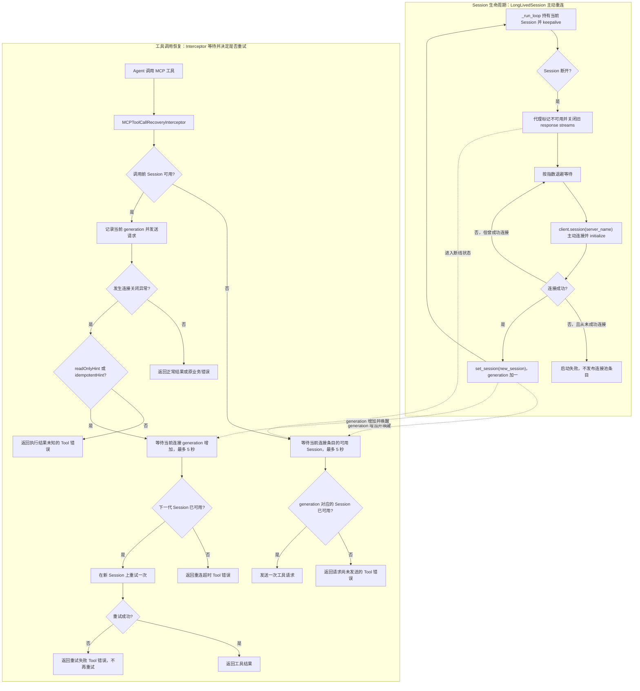

# MCP 工具调用断线恢复设计

> 日期：2026-08-01
> 状态：评审修订稿
> 主题：修复 MCP Server 重启或连接中断时，在途工具调用异常穿透并终止整个聊天流的问题

## 1. 结论摘要

当前 Yuxi 已经具备 MCP Session 后台重连框架，但连续重连存在缺陷，并且没有对已经失败的 `call_tool` 做恢复处理。

当 MCP Server 在工具调用过程中重启时：

1. `LongLivedSession._run_loop()` 检测到底层 Session 退出。
2. `LongLivedSession` 将 `_SessionProxy` 标记为不可用，并负责按退避策略主动建立同一连接条目的新 Session。
3. 已经发出的工具调用仍等待旧 Session 的 response stream。
4. 旧 stream 关闭后，调用可能收到 `EndOfStream`、`ClosedResourceError` 或 `BrokenResourceError`。
5. 异常未经 MCP 工具边界转换，穿透 LangChain Tool 和 LangGraph ToolNode，最终终止聊天流。
6. 后台 Session 即使随后重连成功，也只能提供新的调用通道，不能恢复已经失败的旧 request；安全工具必须在新 Session 上重新发送一次。

推荐方案是在 `langchain-mcp-adapters` 提供的 `tool_interceptors` 扩展点实现 MCP 专用调用恢复拦截器，修复 `LongLivedSession` 的连续重连循环，并让 `_SessionProxy` 提供代次感知的连接等待能力。

确定的恢复策略为：

- 调用前 Session 已不可用：请求尚未发送，等待当前 `LongLivedSession` 主动建立该连接条目的下一代 Session，随后正常发送一次。
- 调用过程中断线，工具声明 `readOnlyHint=true` 或 `idempotentHint=true`：等待当前连接条目的 generation 增加，随后自动重试一次。
- 调用过程中断线，工具未声明只读或幂等：不自动重试，返回“执行结果未知”的 Tool 错误。
- `LongLivedSession` 是创建和重建 ClientSession 的唯一所有者；恢复拦截器只等待状态变化，不并行创建第二条连接。
- 工具调用最多等待重连 5 秒，可通过环境变量调整；等待超时只结束本次工具恢复，不停止后台重连。
- 预期连接错误必须转换为 Tool 错误，让聊天继续，不再直接终止消息流。
- 不修改 MCP SDK、LangChain MCP Adapter、数据库或前端。

## 2. 目标与验收标准

### 2.1 目标

- MCP Server 短暂重启后，连接池继续自动恢复 Session。
- 初次连接成功后，即使连续多次重连失败，后台循环也持续运行，直到成功或收到停止指令。
- 临时断线期间，同一配置的连接池条目和 `_SessionProxy` 保持不变，不产生并行重连任务。
- 安全工具在连接恢复后自动重试一次。
- 未声明安全语义的工具不被自动重放。
- 预期的 MCP 连接关闭不再中止整个聊天流。
- 错误信息明确说明请求是否可能已经执行。
- Token 提前刷新、401 刷新和权限隔离行为保持不变。
- HTTP、SSE、Streamable HTTP 和 Stdio MCP 的正常调用不受影响。

### 2.2 验收清单

- [ ] 调用前 Session 已断开时，系统等待重连并且只发送一次请求。
- [ ] 初次连接失败时启动明确失败，不发布无效连接池条目。
- [ ] 初次连接曾成功后，连续重连失败不会使 `_run_loop` 退出。
- [ ] 临时断线期间再次获取相同连接时，不淘汰正在重连的 `LongLivedSession`。
- [ ] 5 秒工具等待超时后，后台重连仍然继续。
- [ ] `readOnlyHint=true` 的工具断线后最多自动重试一次。
- [ ] `idempotentHint=true` 的工具断线后最多自动重试一次。
- [ ] 未标注工具断线后不自动重试。
- [ ] 未标注工具返回“执行结果未知”的 Tool 错误，聊天流继续。
- [ ] 5 秒内未重连时返回明确 Tool 错误，聊天流继续。
- [ ] 重连后的第二次调用仍失败时不进行第三次调用。
- [ ] `EndOfStream`、`ClosedResourceError` 和 `BrokenResourceError` 得到一致处理。
- [ ] 普通业务错误、参数错误和代码错误不会被错误归类为连接中断。
- [ ] Token、请求头和工具参数不会写入恢复日志。
- [ ] `manual_mcp_13_token_pre_refresh` 行为保持不变。
- [ ] 401 Token 刷新重试行为保持不变。
- [ ] 真实 Demo Server 重启场景通过集成测试和 E2E。

## 3. 当前实现与根因

### 3.1 已有后台重连框架

`backend/package/yuxi/agents/mcp/client_pool.py` 中的 `LongLivedSession` 已经负责：

- 长期维护 MCP ClientSession。
- 使用 `_SessionProxy` 将工具闭包指向当前 Session。
- 设计上在连接断开后按 1 秒起始、最大 30 秒的指数退避重连。
- 重连后将代理切换到新 Session。
- 通过 ping 检测空闲连接是否仍然有效。

`MultiServerMCPClient.session(server_name)` 会主动创建连接并执行 `initialize()`；成功返回后，`LongLivedSession` 才通过 `_SessionProxy.set_session()` 发布该 Session。因此，主动创建新 Session 的职责属于 `LongLivedSession._run_loop()`，不是等待中的工具调用。

现有重连框架可以保留，但必须修复下面的连续重连缺陷。

### 3.2 首次重连失败后循环退出的缺陷

当前 `_run_loop()` 在异常分支使用 `_SessionProxy.is_connected` 判断是否属于首次连接失败：

```python
if not self._session_proxy.is_connected:
    logger.warning("Failed to start MCP session ...")
    break
```

旧 Session 断开后，代理会被设置为不可用。若第一次重连尝试在新 Session 发布前失败，`is_connected` 仍为 `False`，上述判断会把它误认为“首次启动失败”并退出后台循环。

此时连接池中仍可能保留这个已经停止的 `LongLivedSession`。未来一次 `get_session()` 可能将其淘汰并创建新条目，但当前工具恢复拦截器等待的是旧 `_SessionProxy`，不会被新条目唤醒。因此单纯增加 `wait_for_session()` 不足以保证恢复。

必须同时保证：

- 使用现有 `first_connect` 状态区分“从未成功连接”和“已连接过、正在重连”。
- 从未成功连接时，连接失败继续按当前行为使 `start()` 失败，连接池不发布条目。
- 只要至少成功连接过一次，后续连接尝试失败就继续退避重试，不能因为代理暂时不可用而退出。
- 同一 cache key 和配置 hash 的 `LongLivedSession` 正在重连时，连接池不得仅因 `is_connected=False` 将其淘汰。
- 重连任务只在收到 `stop`、配置被替换、连接被明确移除或连接池关闭时结束。

### 3.3 在途调用无法迁移

MCP `tools/call` 是带 request ID 的请求响应过程。已经发送的请求与 response stream 属于旧 Session。旧连接退出后，该请求不能迁移到新 Session，也不能从新 Session 继续等待旧响应。

因此，“在途调用仍绑定旧 Session”属于协议和连接生命周期的固有限制，不是代码缺陷。

### 3.4 聊天流被终止的根因

Yuxi 当前把 MCP 工具设置为 `handle_tool_error=True`，但 LangChain 只会据此处理 `ToolException`，不会处理任意传输异常。

当前异常传播路径为：

```text
MCP Server 重启
    ↓
旧 response stream 关闭
    ↓
MCP SDK send_request 抛出流关闭异常
    ↓
langchain-mcp-adapters 重新抛出异常
    ↓
StructuredTool 重新抛出普通 Exception
    ↓
ToolNode 默认处理器重新抛出
    ↓
LangGraph stream 终止
    ↓
chat_service 记录 Error streaming messages
```

因此真正需要修复的是：MCP 工具边界没有将预期的连接关闭异常转换成可由 Agent 消费的 Tool 错误。

### 3.5 `ClosedResourceError` 的两种来源

第一种是调用前错误：

- `_SessionProxy` 已经没有 Session。
- 新工具调用访问代理方法。
- `_SessionProxy.__getattr__()` 直接抛出 `ClosedResourceError`。
- 请求确定没有发送到 MCP Server。

第二种是在途调用错误：

- 请求已经发送并等待 response stream。
- 连接池主动关闭旧 Session 的 pending streams。
- 根据关闭时机，AnyIO 可能抛出 `EndOfStream`、`ClosedResourceError` 或 `BrokenResourceError`。
- 请求是否已经在服务端产生副作用无法确定。

现有代码注释把关闭 pending streams 的结果写死为 `ClosedResourceError`，并不准确。实现时应改为“快速收到流关闭异常”。

## 4. 方案比较

### 4.1 方案 A：MCP Tool Interceptor + Session 代次 + 单一重连所有者

这是推荐方案。

通过 `langchain-mcp-adapters` 的公开 `tool_interceptors` 扩展点包围每次 MCP 工具调用。拦截器负责：

- 判断调用前是否已有可用 Session。
- 记录调用开始时的 Session generation。
- 捕获明确的连接关闭异常。
- 依据 MCP ToolAnnotations 判断是否允许重试。
- 等待 generation 增加后重试一次。
- 将无法恢复的连接错误转换为标准 MCP `CallToolResult(isError=True)`。

优点：

- 恢复逻辑只作用于 MCP 工具。
- 使用第三方包的正式扩展点，不需要 fork 或 monkey patch。
- 可以直接调用同一个 handler 完成重试。
- 返回标准 MCP 错误后，可复用现有 `handle_tool_error=True` 行为。
- 不把 MCP 传输细节扩散到通用 Agent 中间件。

缺点：

- `LongLivedSession` 需要修复首次重连失败后退出的问题。
- `MCPClientPool` 需要在临时断线期间保留正在重连的连接条目。
- `_SessionProxy` 需要新增 generation 和重连等待接口。
- 拦截器需要在工具加载后获得工具注解策略。

### 4.2 方案 B：在 RuntimeConfigMiddleware 捕获并重试

`RuntimeConfigMiddleware.awrap_tool_call()` 可以读取 LangChain Tool metadata，也能捕获工具异常。

优点：

- 可以直接判断工具注解。
- 不需要使用 Adapter interceptor。

缺点：

- Middleware 无法自然获得具体 `_SessionProxy` 的 generation。
- 需要从工具或连接池反向寻找 Session，增加耦合。
- 容易把通用运行时配置职责和 MCP 传输恢复混在一起。
- 固定 sleep 后再次调用存在再次命中旧 Session 的竞态。

不采用该方案。

### 4.3 方案 C：全局捕获 ToolNode 异常

通过 LangGraph ToolNode 的通用异常处理，把所有工具异常转换成 ToolMessage。

优点：

- 可以快速避免聊天流终止。

缺点：

- 会影响内置工具、知识库工具、Skills 等非 MCP 工具。
- 可能掩盖真实程序错误。
- 无法可靠等待 MCP Session 重连。
- 无法安全判断是否允许重试。

不采用该方案。

### 4.4 不修改第三方包

当前版本行为已经确认：

- MCP SDK 的 `ClientSession.call_tool()` 只调用一次 `send_request()`，没有调用级重试。
- `langchain-mcp-adapters` 直接调用 `session.call_tool()`，异常会向上抛出。
- Adapter 已明确提供 `tool_interceptors` 用于重试和错误处理。

重试策略需要知道服务是否可信、工具是否允许重复执行，属于 Yuxi 应用侧责任，不应修改或 fork 第三方包。

## 5. 推荐架构



图中的等待不是建立连接的动作。`LongLivedSession._run_loop()` 是唯一主动调用 `client.session()` 的组件；恢复拦截器只等待同一连接条目的状态事件，避免并行创建两个 Session、重复 initialize 或产生代理切换竞态。

### 5.1 组件职责

#### `_SessionProxy`

继续负责将工具闭包委托到当前 Session，并新增：

- `generation`：成功绑定新 Session 时递增。
- 连接可用事件：有 Session 时置位，无 Session 时清除。
- `wait_for_session()`：调用前没有 Session 时，等待当前连接条目重新绑定可用 Session。
- `wait_for_new_session(after_generation)`：在途调用断线后，只等待当前连接条目绑定 generation 更大的 Session。

这两个方法都是状态等待接口，不创建 ClientSession、不调用连接池，也不启动第二个重连任务。

断开顺序调整为：

1. 保存旧 Session 引用。
2. 立即把代理标记为不可用并清除连接事件。
3. 关闭旧 Session 的 pending response streams。

这样可以避免旧流关闭期间的新调用继续进入旧 Session。

#### `LongLivedSession`

作为 ClientSession 创建和重建的唯一所有者，修复现有重连循环并保留退避策略：

- 使用 `first_connect` 判断是否从未成功建立 Session。
- 首次启动连接失败时终止 `start()`，保持当前快速暴露配置或鉴权错误的行为。
- 首次连接成功后，即使后续多次连接失败，也持续按指数退避重试，直到连接成功或收到停止指令。
- 重连尝试失败时不得因为 `_SessionProxy.is_connected=False` 退出循环。
- 任意时刻同一个 `LongLivedSession` 最多只有一个 `_run_loop` 和一个连接尝试。

每次新 ClientSession 完成 initialize 后，通过 `_SessionProxy.set_session()`：

- 绑定新 Session。
- generation 加一。
- 唤醒全部重连等待者。

不修改当前 1 秒起始、最大 30 秒的指数退避参数。工具调用的 5 秒等待不会取消或停止这个后台循环。

#### `MCPClientPool`

临时断线期间必须保持连接条目稳定：

- cache key 和配置 hash 相同，且 `LongLivedSession` 的后台循环仍在运行时，不因代理暂时不可用而淘汰该条目。
- 需要获取 Session 的并发调用等待同一个 `_SessionProxy` 恢复，而不是创建新的 `LongLivedSession`；该等待复用 `YUXI_MCP_TOOL_RECONNECT_WAIT_SECONDS`，不新增第二个超时配置。
- `_dict_lock` 只用于确认和保留连接池条目，实际等待必须在锁外进行，避免一个 MCP Server 的重连阻塞其他连接池操作。
- 等待超时可以让当前获取操作失败，但不能停止或替换仍在后台重连的条目。
- 只有配置变化、显式 remove、后台任务已经退出或连接池关闭时才淘汰条目。

该约束是 generation 等待能够可靠唤醒的必要条件：如果连接池在断线窗口创建新条目，旧工具闭包仍绑定旧代理，永远看不到新条目的 generation。

#### `MCPToolCallRecoveryInterceptor`

放在 MCP 连接池模块内，与 Session 生命周期和传输异常保持同一职责边界。

拦截器持有：

- `_SessionProxy`。
- 工具名称到安全重试标记的映射。
- 最大重连等待秒数。

拦截器不调用 `client.session()`，不创建或替换连接池条目，也不保存用户身份、Token、请求头或工具参数。

#### `tool_registry_service`

加载工具时：

1. 创建共享的工具安全策略映射。
2. 创建绑定当前 `_SessionProxy` 的恢复拦截器。
3. 调用 `load_mcp_tools(..., tool_interceptors=[interceptor])`。
4. 根据返回 LangChain Tool 的 metadata 填充安全策略映射。
5. 继续添加现有 `id`、`mcp_server_name` 和 `handle_tool_error=True`。

工具只会在加载完成并返回 Agent 后执行，因此在工具调用发生前，安全策略映射已经完整。

### 5.2 工具安全重试资格

只使用 MCP 标准 ToolAnnotations：

- `readOnlyHint is True`
- `idempotentHint is True`

满足任意一个即允许在“请求已开始后断线”的情况下自动重试一次。

以下方式明确禁止：

- 不根据工具名称猜测。
- 不根据 description 文案猜测。
- 不让 LLM 判断是否幂等。
- 不默认把未标注工具视为安全。
- 不新增数据库或前端逐工具重试配置。

MCP ToolAnnotations 是提示信息，管理员应只接入可信 MCP Server。Yuxi 的保守默认值是：没有明确 `True` 就不重试。

### 5.3 等待时间与重试次数

新增环境变量：

```text
YUXI_MCP_TOOL_RECONNECT_WAIT_SECONDS=5
```

语义：

- 默认等待 5 秒。
- 允许使用非负浮点数。
- `0` 表示不等待重连。
- 等待对象是当前 server、当前 partition、当前配置 hash 对应的同一个 `_SessionProxy`，不是连接池中的任意 Session。
- 等待动作不创建连接；`LongLivedSession._run_loop()` 在后台主动执行重连。
- 仅限制单次工具调用或工具加载对临时重连的等待，不修改或取消连接池后台重连策略。
- 5 秒内没有出现新 generation 时，本次工具调用返回 Tool 错误；后台循环继续按 1、2、4、8 秒等退避节奏重连，后续调用仍可恢复。
- 5 秒是等待上限，不承诺 MCP Server 在该时间内一定恢复，也不要求后台循环为单次工具调用额外创建并行连接。

重试次数固定为一次，不增加额外配置项。

## 6. 异常分类

### 6.1 连接关闭异常

恢复拦截器只识别：

- `anyio.EndOfStream`
- `anyio.ClosedResourceError`
- `anyio.BrokenResourceError`
- `httpx.ConnectError`
- `httpx.ReadError`
- `httpx.RemoteProtocolError`
- `ConnectionResetError`
- `BrokenPipeError`
- 所有叶子异常均属于上述连接异常的 `BaseExceptionGroup`

异常组按子异常递归检查。只有至少包含一个叶子异常，且所有叶子异常都属于上述明确连接异常时，才进入恢复分支。只要混有取消异常、程序错误或其他未知异常，就保持原异常传播，避免误吞真实缺陷或破坏取消语义。

### 6.2 请求超时

请求超时不自动重试。

原因：

- 超时不等同于 Session 已断开。
- 服务端可能仍在执行长任务。
- 立即重试可能重复消耗资源或放大负载。

MCP 请求超时应转换成 Tool 错误，让聊天继续，并提示调用结果未知。

### 6.3 不由恢复拦截器处理的错误

- MCP 正常返回的 `CallToolResult(isError=True)`。
- `ToolException`。
- 参数校验错误。
- MCP 业务错误。
- 普通 `ValueError`、`TypeError` 等程序错误。
- 401 鉴权错误。
- `CancelledError`、`KeyboardInterrupt`、`SystemExit`。

这些错误继续由现有层处理，避免吞掉真实缺陷或破坏取消语义。

### 6.4 401 与 Token 刷新边界

动态 Token 的 401 重试继续由 `DynamicMCPTokenAuth` 负责：

1. 清除请求头缓存和 Redis access token。
2. 重新解析并获取 Token。
3. 通过 HTTPX Auth 的第二次 yield 重发 HTTP 请求。

恢复拦截器不接管 401，不清理 Token，不修改连接状态。

Session 重连后，新的 HTTP 请求仍会通过 `DynamicMCPTokenAuth` 注入当前有效 Token。

## 7. 错误返回与聊天行为

预期的连接恢复失败统一返回：

```python
CallToolResult(
    isError=True,
    content=[TextContent(type="text", text="...")],
)
```

`langchain-mcp-adapters` 会将 `isError=True` 转成 `ToolException`，现有 `handle_tool_error=True` 再将其转换成 ToolMessage。因此 LangGraph 会继续运行，模型可以解释错误或继续执行其他步骤。

### 7.1 调用前未连接

```text
MCP 服务「{server_name}」当前不可用，5 秒内未恢复。本次工具请求尚未发送。
```

### 7.2 未标注工具在途断线

```text
MCP 服务「{server_name}」在工具「{tool_name}」执行期间连接中断。该工具未声明为只读或幂等，系统未自动重试；执行结果可能已经生效，请确认后再试。
```

### 7.3 安全工具重连超时

```text
MCP 服务「{server_name}」连接中断，5 秒内未恢复，工具「{tool_name}」的自动重试未执行。
```

### 7.4 重试再次失败

```text
MCP 服务「{server_name}」已重连，但工具「{tool_name}」自动重试仍然失败。
```

错误内容面向模型和用户，必须同时说明：

- 是否发生自动重试。
- 请求是否可能已经生效。
- 是否可以安全再次尝试。

## 8. 日志设计

连接恢复日志记录：

- MCP Server 名称。
- 工具名称。
- 异常类型。
- 调用开始时的 generation。
- 重连后的 generation。
- 工具是否符合安全重试条件。
- 等待是否超时。
- 是否执行了自动重试。
- 自动重试是否成功。

不记录：

- 工具参数。
- Tool result 原文。
- Authorization header。
- access token、refresh token。
- connection credential。

空字符串异常必须通过异常类型补全日志，例如：

```text
MCP tool call interrupted: server=..., tool=..., error=EndOfStream
```

不再只记录空白的 `Error streaming messages:`。

## 9. Demo MCP Server 测试能力

### 9.1 工具注解

给现有回显工具添加符合其真实语义的注解：

- `echo_global`
- `echo_dept_data`
- `echo_user_profile`

统一声明：

```text
readOnlyHint=true
idempotentHint=true
destructiveHint=false
```

### 9.2 延迟工具

新增 `echo_delayed_safe`：

- 参数：`message`、`delay_seconds`。
- 延迟后返回回显。
- 声明只读、幂等、非破坏性。
- 用于验证自动重试成功。

新增 `echo_delayed_unannotated`：

- 参数和行为与安全延迟工具相同。
- 不声明 ToolAnnotations。
- 用于验证保守默认策略。

### 9.3 故障控制接口

Demo Server 增加测试专用接口：

- `GET /test/faults/state`
  - 返回当前正在执行的延迟工具名称和数量。
  - 不返回请求参数。
- `POST /test/faults/restart`
  - 先返回 HTTP 响应。
  - 随后向当前 Demo Server 主进程发送退出信号。

Compose 已为 `mcp-demo-server` 配置 `restart: unless-stopped`。进程退出后容器会真实重启，从而覆盖 Docker DNS 短暂不可用、HTTP 连接关闭和 MCP Session 重建。

这些接口只存在于 `backend/test/mcp_demo_server.py`，不进入生产 API。

## 10. 测试设计

### 10.1 单元测试

扩充 `backend/test/unit/services/test_mcp_client_pool.py`，覆盖以下职责。

`LongLivedSession` 和连接池生命周期：

1. 真正的首次连接失败时 `start()` 失败，连接池不发布条目。
2. 首次连接成功后，第一次重连尝试失败不会使 `_run_loop` 退出。
3. 连续多次重连失败后仍继续退避，并在后续成功时重新绑定同一 `_SessionProxy`。
4. 重连成功后 generation 只增加一次，不为失败的连接尝试增加。
5. 收到 `stop` 时可以从重连退避中立即退出。
6. 同一个 `LongLivedSession` 不会并行启动两个 `_run_loop`。
7. cache key 和配置 hash 相同且后台循环仍在重连时，`get_session()` 不淘汰原条目。
8. 并发 `get_session()` 等待并返回同一个代理，不创建第二个 `LongLivedSession`。
9. `get_session()` 在 `_dict_lock` 外等待，其他 server 或 partition 的池操作不被阻塞。
10. 当前获取操作等待超时后，后台重连任务仍然运行。
11. 配置 hash 改变、显式 remove 或连接池关闭时，原条目仍按现有行为停止并淘汰。

`_SessionProxy` 和恢复拦截器：

1. `_SessionProxy` 初始 generation 为 0。
2. 首次绑定 Session 后 generation 为 1。
3. 断开时 generation 不增加，连接事件清除。
4. 绑定新 Session 后 generation 增加并唤醒等待者。
5. 多个等待者能被同一次重连同时唤醒。
6. `wait_for_new_session()` 不会被同一 generation 或其他连接条目唤醒。
7. 等待超时返回明确失败结果，但不触发新连接任务。
8. 调用前未连接时，等待成功后 handler 只执行一次。
9. 调用前未连接且等待超时时，handler 不执行。
10. `readOnlyHint` 工具收到 `EndOfStream` 后重试一次。
11. `idempotentHint` 工具收到 `ClosedResourceError` 后重试一次。
12. 安全工具收到 `BrokenResourceError` 后重试一次。
13. 未标注工具收到连接关闭异常后不重试。
14. 重连超时时不进行第二次 handler 调用。
15. 第二次调用再次出现连接错误时不进行第三次调用。
16. 仅由连接异常组成的 `BaseExceptionGroup` 可以识别。
17. 混有 `ValueError` 或取消异常的异常组继续传播。
18. 请求超时转换成 Tool 错误但不重试。
19. 普通 `ValueError` 继续抛出。
20. 取消异常继续传播。
21. 日志不包含工具参数、Token 或请求头。

扩充 `backend/test/unit/services/test_mcp_tool_registry_service.py`，覆盖：

1. `load_mcp_tools()` 收到恢复拦截器。
2. `readOnlyHint=true` 进入安全重试集合。
3. `idempotentHint=true` 进入安全重试集合。
4. 未标注工具不进入安全重试集合。
5. 原有 `id`、`mcp_server_name` 和 `handle_tool_error` 保持不变。
6. 非 MCP 工具不受影响。

### 10.2 真实集成测试

新增 MCP 重连集成测试，使用真实：

- MCP CRUD API。
- Postgres MCPServer/MCPConnection 配置。
- Runtime MCP 配置解析。
- `mcp-demo-server` 容器。
- MCP SDK。
- LangChain MCP Adapter。
- Yuxi MCPClientPool。

安全工具场景：

1. 通过 API 创建测试 MCP Server 和连接配置。
2. 加载 `echo_delayed_safe`。
3. 异步启动工具调用。
4. 轮询 `/test/faults/state`，确认工具已经开始执行。
5. 调用 `/test/faults/restart`。
6. 断线窗口内再次请求相同 cache key，验证连接池没有创建第二个 `LongLivedSession` 或替换原代理。
7. 等待容器自动恢复和原 `_SessionProxy` 的 Session generation 增加。
8. 验证工具自动重试一次并成功返回。
9. 验证下一次普通 MCP 调用继续成功。

未标注工具场景：

1. 加载 `echo_delayed_unannotated`。
2. 工具执行过程中重启 Demo Server。
3. 验证调用返回 Tool 错误而不是向上抛出流异常。
4. 验证错误包含“未自动重试”和“执行结果可能已经生效”。
5. 验证恢复后的下一次普通 MCP 调用成功。

测试必须在 `finally` 中清理创建的 MCP Server 和 connection。

### 10.3 E2E 聊天测试

新增 `backend/test/e2e/test_mcp_reconnect_e2e.py`。

安全工具场景：

1. 创建专用 MCP Server、连接、Agent Config 和 Chat Thread。
2. Agent Config 只启用目标 MCP，降低工具选择不确定性。
3. 通过 `/api/chat/agent` 发起真实流式聊天，明确要求调用 `echo_delayed_safe`。
4. 工具开始后通过 Demo fault API 重启 Server。
5. 断言流式响应没有出现 `Error streaming messages`。
6. 断言最终 Assistant 消息正常生成。
7. 断言工具结果来自重连后的成功调用。
8. 再发送一条消息，验证后续 MCP 调用继续正常。

未标注工具场景：

1. 明确要求调用 `echo_delayed_unannotated`。
2. 工具开始后重启 Demo Server。
3. 断言聊天流没有中止。
4. 断言 Tool 错误说明未自动重试和执行结果未知。
5. 测试 Agent 的 system prompt 明确要求发生工具错误时不要自行再次调用，避免模型层重试干扰底层断言。
6. 断言后续聊天仍可继续。

E2E 不断言底层必须抛出某一个具体 AnyIO 异常，只断言支持的连接关闭异常最终得到一致的用户行为。

### 10.4 回归验证

实现完成后至少运行：

```bash
docker exec api-dev uv run --group test pytest \
  test/unit/services/test_mcp_client_pool.py \
  test/unit/services/test_mcp_tool_registry_service.py -q
```

```bash
docker exec api-dev uv run --group test pytest \
  test/integration -k "mcp and reconnect" -q
```

```bash
docker exec api-dev uv run --group test pytest \
  test/e2e/test_mcp_reconnect_e2e.py -m e2e -q
```

```bash
docker exec api-dev uv run --group dev ruff check \
  package/yuxi/agents/mcp/client_pool.py \
  package/yuxi/agents/mcp/tool_registry_service.py \
  test/mcp_demo_server.py \
  test/unit/services/test_mcp_client_pool.py \
  test/unit/services/test_mcp_tool_registry_service.py \
  test/e2e/test_mcp_reconnect_e2e.py
```

还需手工确认：

- `manual_mcp_13_token_pre_refresh` 的 15 秒 Token 和提前刷新测试行为不变。
- 重启发生在安全工具调用期间时，聊天能够继续并完成。
- 重启发生在未标注工具调用期间时，聊天继续但不自动重试。
- MCP Server 持续不可用超过 5 秒时，页面收到明确错误而不是空白 streaming error。

## 11. 文件改动范围

预计修改：

- `backend/package/yuxi/agents/mcp/client_pool.py`
- `backend/package/yuxi/agents/mcp/tool_registry_service.py`
- `backend/test/mcp_demo_server.py`
- `backend/test/unit/services/test_mcp_client_pool.py`
- `backend/test/unit/services/test_mcp_tool_registry_service.py`
- `backend/test/integration/...` 下一个职责明确的 MCP 重连测试文件
- `backend/test/e2e/test_mcp_reconnect_e2e.py`
- `docs/develop-guides/roadmap.md`

不修改：

- MCP Auth 数据模型。
- MCP CRUD API。
- MCPConnection 数据库结构。
- 前端 MCP 配置页面。
- Redis Token 缓存结构。
- `DynamicMCPTokenAuth` 的 401 行为。
- 第三方 MCP 或 LangChain 包。
- Redis 工具 Manifest 格式；该 Manifest 不参与运行时工具调用恢复。

## 12. 兼容性与风险

### 12.1 重复执行风险

只有显式声明只读或幂等的工具才会在请求已开始后自动重试。未标注工具保守失败，避免重复写入、重复发送或重复创建资源。

### 12.2 错误注解风险

ToolAnnotations 由 MCP Server 提供，属于提示信息。管理员错误接入不可信或错误标注的 Server，仍可能导致重复执行。Yuxi 不对未标注工具做推断，也不允许模型覆盖该策略。

### 12.3 慢重启风险

默认等待 5 秒只覆盖短暂网络抖动和常见容器快速重启。它是工具调用的耐心上限，不是后台重连总时长。更慢的恢复会让本次工具调用返回 Tool 错误，但同一个 `LongLivedSession` 继续在后台重连；后续调用仍可恢复。

### 12.4 并发调用

多个安全工具可以等待同一次 generation 增加，并在新 Session 上分别重试。连接创建仍由单个 `_run_loop` 串行负责，不会因为等待者数量增加而创建并行 Session。因为这些工具已声明只读或幂等，不需要为工具执行增加全局串行锁。

### 12.5 Stdio 兼容

Stdio 子进程退出同样可能表现为 AnyIO stream 关闭异常。恢复拦截器使用统一连接错误分类，不依赖 HTTP 专属行为。正常 Stdio 工具调用不会增加重试或等待。

## 13. 实施顺序

1. 先为“首次重连失败后循环退出”和“重连期间连接池淘汰旧代理”编写失败单元测试。
2. 使用 `first_connect` 修复 `LongLivedSession` 连续重连条件，确保已成功连接过的后台循环只因明确停止而退出。
3. 修复 `MCPClientPool.get_session()` 对正在重连条目的复用与等待，避免替换旧代理。
4. 为 `_SessionProxy` 实现 generation 和连接状态等待。
5. 为恢复拦截器编写失败单元测试并实现 `MCPToolCallRecoveryInterceptor`。
6. 在工具加载路径接入 interceptor 和 ToolAnnotations 策略。
7. 完成目标单元测试和 Ruff。
8. 扩展 Demo Server 的延迟工具、注解与故障控制接口。
9. 增加真实集成测试和 E2E 聊天重启测试。
10. 回归 Token 提前刷新、401、普通 MCP 和 Stdio 场景。
11. 更新 roadmap，检查最终 diff 只包含本需求必要改动。

## 14. 完成定义

本任务只有在以下条件全部满足时才算完成：

- 自动重连和调用级恢复职责边界清晰。
- `LongLivedSession` 是唯一主动创建 Session 的组件，等待者不会并行建立连接。
- 初次连接成功后，连续重连失败不会使后台循环提前退出。
- 临时断线期间，同一配置的连接池条目和 `_SessionProxy` 不被替换。
- 5 秒工具等待超时不会停止后台重连。
- 安全工具最多自动重试一次。
- 未标注工具绝不自动重放。
- 所有预期连接关闭都不会直接终止聊天流。
- 真实 Demo Server 重启测试可重复执行。
- 单元、集成、E2E 和 Ruff 全部通过。
- Token 和权限相关回归测试通过。
- 没有引入数据库或前端改动。
- 没有修改第三方包。
- 没有提交工作区中与本任务无关的已有改动。
